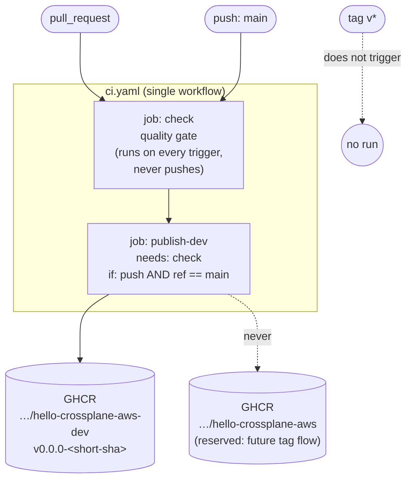

# Design Document

## Overview

This design documents the single GitHub Actions workflow
(`.github/workflows/ci.yaml`) that gates every change with a quality check and
publishes a snapshot package to GHCR on merges to `main`. It is the only
workflow in the repository, per the steering rule that `ci.yaml` is the single
source of CI truth (`tech.md#ci-and-versioning`, R10.3).

An implementation already exists. This design describes that actual design and
explicitly reconciles it against the stricter refined acceptance criteria in a
[Divergences / open decisions](#divergences--open-decisions) subsection, so the
tasks phase can decide which guards to add and which to accept as documented
non-goals for this proof of concept.

The workflow has one behavioural axis — the trigger — with three cases:

| Trigger              | Checks run | Package pushed | Registry / version                       |
| -------------------- | ---------- | -------------- | ---------------------------------------- |
| Pull request         | Yes        | No             | — (R1, R5.2)                             |
| Push to `main`       | Yes        | Yes            | `…-dev` @ `v0.0.0-<short-sha>` (R2, R4)  |
| Tag `v*` (today)     | No         | No             | — workflow does not trigger (R6.3)      |

The design maps to the ten requirements as follows:

- **R1** (PR runs checks only) → the `check` job runs on every trigger; the
  `publish-dev` job is gated off for pull requests.
- **R2, R4** (main merge publishes) → the `publish-dev` job, gated by
  `needs: check` and a main-only `if`.
- **R3** (quality gate) → the ordered steps inside `check`, scoped to the Go
  module and the Example_Set.
- **R5, R6** (fixed versioning / registry split, tag flow is future) →
  `DEV_REPO` / `RELEASE_REPO` env constants and trigger scoping.
- **R7** (CLI pinning) → `XP_VERSION` env and the official `install.sh`.
- **R8** (repository-flag consistency) → the shared `$DEV_REPO` variable passed
  to both `build` and `push`.
- **R9** (dependency cache prep) → `actions/cache` + `dependency update-cache`
  before `project build`.
- **R10** (permissions and environment) → the top-level `permissions` block,
  the single-file location, and the Docker-capable `ubuntu-latest` runner.

## Architecture

### Trigger and job topology



Two jobs, one workflow:

- **`check`** — the quality gate. Runs on every trigger (PR and push to `main`).
  Never logs in to GHCR and never pushes a package. This is the R1 guarantee for
  pull requests and the R2.1 pre-publish gate for main.
- **`publish-dev`** — the snapshot publish path. Declares `needs: check`, so it
  only starts after the gate passes (R2.5, R4.6), and carries a job-level
  condition `if: github.event_name == 'push' && github.ref == 'refs/heads/main'`
  so it runs only on a main merge and is skipped for pull requests (R1.2, R1.3,
  R5.2).

### Why one workflow with a job-level `if`, not two workflow files

The steering documents fix `ci.yaml` as *the only workflow*
(`tech.md`, `product.md`, R10.3). Splitting the PR path and the main path into
separate files would break that invariant and duplicate the quality gate. The
PR-vs-main distinction is a data condition on a shared pipeline, not two
pipelines, so it is expressed as:

- `on:` listing both `pull_request` and `push: branches: [main]`, and
- a job-level `if` on `publish-dev` that fires only for the main push.

This keeps the gate defined once and shared by both triggers, and keeps the
whole of CI in a single reviewable file. Tags are simply absent from the `on:`
list, which is what makes R6.3 hold structurally (see below).

### Runner and environment

All jobs run on `ubuntu-latest`, which ships a reachable Docker daemon. Docker is
required because `crossplane composition render` builds the embedded function in
a container and `crossplane project build` builds the function package (R10.4).
No self-hosted or containerless runner is used, so the daemon is available by
construction; if it were ever unavailable, the render/build step exits non-zero
and fails the run (R10.5).

Top-level `permissions` are declared once:

```yaml
permissions:
  contents: read
  packages: write
```

`packages: write` is the GHCR publish grant (R10.1); `contents: read` is the
least-privilege default for checkout.

Shared configuration lives in workflow-level `env`:

| Env var        | Value                                          | Purpose                              |
| -------------- | ---------------------------------------------- | ------------------------------------ |
| `XP_VERSION`   | `v2.5.0`                                        | Pin the beta CLI (R7)               |
| `RELEASE_REPO` | `ghcr.io/hoangviet1vu/hello-crossplane-aws`     | Future tag flow target (R6.1)       |
| `DEV_REPO`     | `ghcr.io/hoangviet1vu/hello-crossplane-aws-dev` | Main-snapshot target (R4.1, R5.1)   |
| `FUNCTION_DIR` | `functions/compose-tenant-environment`          | Go module path for the gate         |

`RELEASE_REPO` and `DEV_REPO` are two distinct, non-equal constants (R6.2). The
active publish path references only `DEV_REPO`; `RELEASE_REPO` is defined but
unused today, reserved for the tag job.

## Components and Interfaces

### Component 1: The `check` job (Quality_Gate)

Runs on every trigger. Steps, in order (R3):

1. **Checkout** — `actions/checkout@v4`.
2. **Set up Go** — `actions/setup-go@v5` with
   `go-version-file: ${{ env.FUNCTION_DIR }}/go.mod`, so the Go version tracks
   the module rather than a hardcoded value.
3. **gofmt** — in `FUNCTION_DIR`, run `gofmt -l .`; if the output is non-empty,
   print the offending files and `exit 1` (R3.1, R3.2). `gofmt -l` reports files
   that differ from `gofmt -s` canonical form.
4. **go vet** — `go vet ./...` in `FUNCTION_DIR` (R3.3).
5. **go test** — `go test ./...` in `FUNCTION_DIR` (R3.4).
6. **Install Crossplane CLI** — see Component 3.
7. **Render every example** — loop over `examples/tenantenvironments/*.yaml`,
   running `crossplane composition render <example> apis/tenantenvironments/composition.yaml`
   for each, each wrapped in a `::group::` log fold. Any non-zero render exits
   the step and fails the gate (R3.5). `render` discovers and builds the embedded
   function itself, so no functions-file argument is needed.

The gate is scoped to the single Go module at `functions/compose-tenant-environment`
via `working-directory`, matching R3.1–R3.4 which name that module explicitly.

Because every check runs in one job and a failing step aborts the job, a failure
prevents `publish-dev` from starting (`needs: check`), which is the R1.4 / R2.5
"terminate without publishing, report which check failed" behaviour — GitHub
surfaces the failing step name in the run status.

### Component 2: The `publish-dev` job (main-merge publish path)

Gated by `needs: check` and `if: github.event_name == 'push' && github.ref == 'refs/heads/main'`.
Steps, in order:

1. **Checkout** — `actions/checkout@v4`.
2. **Set up Go** — same `go-version-file` as the gate; the function is compiled
   during `project build`.
3. **Install Crossplane CLI** — see Component 3.
4. **Compute snapshot version** — see Component 4.
5. **Log in to GHCR** — see Component 5.
6. **Cache / refresh dependencies** — see Component 6.
7. **Build package** — `crossplane project build --repository="${DEV_REPO}"`.
8. **Push package** — `crossplane project push --repository="${DEV_REPO}" --tag="<snapshot>"`.

`project push` ships the Configuration package *and* the embedded function
package(s) in a single push (R4.3); the function is never pushed separately.

### Component 3: Crossplane CLI installation and pinning

Both jobs install the CLI the same way:

```bash
curl -sL "https://raw.githubusercontent.com/crossplane/crossplane/master/install.sh" | sh
sudo mv crossplane /usr/local/bin/
crossplane version
```

The official `install.sh` honours the `XP_VERSION` environment variable to select
the version to download, so the pinned `v2.5.0` is what gets installed (R7.1).
`XP_VERSION` is a fixed explicit semver value, never `latest` or a floating tag
(R7.2). The trailing `crossplane version` prints the installed version into the
log for traceability.

> The current install does not *assert* that `XP_VERSION` is set, nor that the
> installed version equals it. See
> [Divergences](#d1-r73--r74--cli-version-preconditions-and-verification).

### Component 4: Snapshot version computation

```bash
echo "tag=v0.0.0-$(git rev-parse --short HEAD)" >> "${GITHUB_OUTPUT}"
```

`git rev-parse --short HEAD` yields the abbreviated commit hash (7 characters in
this repo's default), producing a tag of the form `v0.0.0-<short-sha>`, e.g.
`v0.0.0-a1b2c3d` (R2.4, R4.2). This is a valid semver *prerelease*: the `0.0.0`
release core sorts below every real release `vX.Y.Z`, and the `-<sha>` prerelease
suffix sorts below the `0.0.0` release itself, so a snapshot never wins a
version-constraint resolution against a tagged release (R5.3). The value is
exported via `GITHUB_OUTPUT` and consumed by the push step.

### Component 5: GHCR authentication

```yaml
- uses: docker/login-action@v3
  with:
    registry: ghcr.io
    username: ${{ github.actor }}
    password: ${{ secrets.GITHUB_TOKEN }}
```

Authentication uses the built-in `GITHUB_TOKEN` (R4.4) — no personal access
token. `docker/login-action` writes credentials into the Docker config, and
`crossplane project push` reuses those Docker credentials rather than taking its
own auth flags (R4.5). If login fails, the step exits non-zero and the run
terminates before any push (R4.7).

### Component 6: Dependency cache preparation

```yaml
- uses: actions/cache@v4
  with:
    path: ~/.crossplane/cache
    key: crossplane-cache-${{ hashFiles('crossplane-project.yaml') }}
    restore-keys: |
      crossplane-cache-
- run: crossplane dependency update-cache
```

The cache key embeds `hashFiles('crossplane-project.yaml')`, so a run whose
project file is byte-for-byte identical to a prior run restores that cache, and
any change to the project file produces a distinct key and a cache miss (R9.2).
The `restore-keys` prefix allows a partial restore to warm the cache on a miss.
`crossplane dependency update-cache` then refreshes the cache and regenerates the
Go models before build (R9.1). If it exits non-zero, the step fails and
`project build` never runs (R9.3).

### Component 7: Build and push with a consistent repository flag

Both invocations reference the same shell variable:

```bash
crossplane project build --repository="${DEV_REPO}"
crossplane project push  --repository="${DEV_REPO}" --tag="<snapshot>"
```

`--repository` is passed explicitly to both `build` (R8.1) and `push` (R8.2),
overriding `spec.repository` in `crossplane-project.yaml` (which stays pointed at
the release repo as the local-publish default). Both reads resolve the identical
`$DEV_REPO` value, so they are byte-for-byte identical by construction (R8.3,
R5.4). This matters because `--repository` determines how embedded functions are
referenced inside the Composition; a mismatch would produce a package whose
function reference points at the wrong registry.

## Data Models

The workflow has no runtime data model; its "data" is a small set of static and
computed configuration values.

### Configuration values (workflow `env`)

| Name           | Kind     | Value / source                    | Consumed by                     |
| -------------- | -------- | --------------------------------- | ------------------------------- |
| `XP_VERSION`   | constant | `v2.5.0`                          | CLI install (both jobs)         |
| `DEV_REPO`     | constant | `…/hello-crossplane-aws-dev`      | build + push (`publish-dev`)    |
| `RELEASE_REPO` | constant | `…/hello-crossplane-aws`          | reserved (future tag job)       |
| `FUNCTION_DIR` | constant | `functions/compose-tenant-environment` | gate steps                 |

### Computed values

| Name              | Source                                   | Shape                 | Consumed by |
| ----------------- | ---------------------------------------- | --------------------- | ----------- |
| `version.outputs.tag` | `v0.0.0-$(git rev-parse --short HEAD)` | semver prerelease     | push step   |

### External identities

| Identity          | Value                                             |
| ----------------- | ------------------------------------------------- |
| GHCR registry     | `ghcr.io`                                          |
| Dev package repo  | `ghcr.io/hoangviet1vu/hello-crossplane-aws-dev`    |
| Release repo (future) | `ghcr.io/hoangviet1vu/hello-crossplane-aws`    |
| Auth token        | `secrets.GITHUB_TOKEN` (built-in)                  |

## Error Handling

The workflow relies on GitHub Actions' default fail-fast semantics: any step that
exits non-zero fails its job, and a failed `check` job prevents the dependent
`publish-dev` job from starting.

| Condition                                  | Handling                                                                 | Requirement |
| ------------------------------------------ | ------------------------------------------------------------------------ | ----------- |
| Unformatted Go files                       | `gofmt` step prints the file list and `exit 1`                          | R3.2        |
| `go vet` / `go test` failure               | Step exits non-zero; gate fails                                          | R3.3, R3.4  |
| Any example fails to render                | `render` exits non-zero inside the loop; step fails, naming the file    | R3.5        |
| Gate fails on PR or main                   | `check` job fails; `publish-dev` never starts (`needs: check`)          | R1.4, R2.5  |
| Build fails on main                        | Build step fails before the push step runs                              | R2.6, R6/R8 |
| GHCR login fails                           | `docker/login-action` step fails before build/push                      | R4.7        |
| `dependency update-cache` fails            | Step fails before `project build`                                        | R9.3        |
| `project push` fails                       | Step fails; run ends; nothing is pushed to `RELEASE_REPO`               | R4.8        |
| Docker unavailable                         | render/build step fails                                                  | R10.5       |

Errors are surfaced through the GitHub run status and the failing step's name and
log; no additional error-reporting mechanism is designed for this PoC.

## Divergences / open decisions

The refined acceptance criteria are stricter than what a straightforward workflow
expresses. This subsection reconciles each gap against the current implementation
and recommends, per item, whether the tasks phase should add an explicit guard or
accept the behaviour as a documented non-goal for this proof of concept. The
guiding principle from `product.md` is *prefer the simplest thing that works end
to end; do not add features that were not asked for* — so the bar for adding a
runtime guard is that it catches a plausible, otherwise-silent failure.

### D1: R7.3 / R7.4 — CLI version preconditions and verification

**Criteria.** Fail if `XP_VERSION` is unset/empty before install (R7.3); fail if
the installed CLI version does not match `XP_VERSION` (R7.4).

**Current.** `XP_VERSION` is set as a literal in workflow `env`, so it can only be
empty if someone edits it away. `install.sh` consumes it, and `crossplane version`
prints (but does not assert) the result.

**Recommendation — implement a small guard.** Both are cheap and catch a real
class of mistake (a bad edit to `env`, or `install.sh` silently falling back to a
default when a pinned version is unavailable). A few shell lines before/after the
install cover it:

```bash
[ -n "${XP_VERSION}" ] || { echo "XP_VERSION is unset/empty"; exit 1; }   # R7.3
# after install:
crossplane version | grep -q "${XP_VERSION}" || { echo "CLI version mismatch"; exit 1; }  # R7.4
```

The exact match string should be verified against `crossplane version` output
format during implementation.

### D2: R8.4 / R8.5 / R5.5 — missing or mismatched `--repository`

**Criteria.** Fail if `build` or `push` is invoked without `--repository`
(R8.4); fail if the two `--repository` values differ (R8.5, R5.5).

**Current.** Both invocations hardcode `--repository="${DEV_REPO}"`, so the flag
is always present and always identical. Sameness is guaranteed *structurally* by
referencing one variable, not by a runtime comparison.

**Recommendation — accept as structural; no runtime guard.** A runtime
equality check would compare a variable against itself, which is theatre. The
real protection is that both steps read the same `$DEV_REPO` and neither omits
the flag. The tasks phase should keep the single-variable pattern and note in the
PR description that R8.3/R8.4/R8.5/R5.5 are satisfied by construction. (When the
tag job is added, it will introduce its own single variable for the release repo;
the same structural argument carries over.)

### D3: R10.2 — fail if permissions lack `packages: write`

**Criterion.** Fail before build/push if effective permissions lack
`packages: write`.

**Current.** The top-level `permissions` block declares `packages: write`. GitHub
does not expose effective permissions as a queryable pre-check inside the run; if
the grant were missing, the GHCR push simply fails with a 403.

**Recommendation — accept as structural.** The declared `permissions` block is
the mechanism; there is no first-class API to assert it at runtime, and inventing
a token-introspection probe is out of scope for a PoC. Treat R10.2 as satisfied by
the declaration, with the natural failure being a push-time auth error (which
R4.7 / R4.8 already cover).

### D4: R3.6 — fail the gate if the Example_Set is empty

**Criterion.** If `examples/tenantenvironments/` contains zero files, fail the
gate.

**Current.** The render step is a `for example in examples/tenantenvironments/*.yaml`
loop. With zero matching files the glob does not expand (default shell behaviour)
and the loop body never runs, so the step would pass silently — a false green.

**Recommendation — implement a small guard.** This is a genuine silent-pass hole
and the fix is one conditional. Count the matches first and fail if none:

```bash
shopt -s nullglob
examples=(examples/tenantenvironments/*.yaml)
[ ${#examples[@]} -gt 0 ] || { echo "Example_Set is empty"; exit 1; }   # R3.6
for example in "${examples[@]}"; do ... done
```

### D5: R6.3 — a `v*` tag today must not push anywhere

**Criterion.** If a `v*` tag triggers the workflow before the tag flow exists, it
must not push to either registry.

**Current.** `on:` lists only `pull_request` and `push: branches: [main]`. A tag
push is not a listed trigger, so the workflow does not run at all for tags.

**Recommendation — no change; document that this satisfies R6.3.** "Does not
trigger" trivially implies "does not push." The tasks phase should record this as
satisfied and note that when the tag flow is added, its publish job must target
`RELEASE_REPO` and be gated on the tag ref — the `DEV_REPO`/`RELEASE_REPO` split
already in `env` makes that a mechanical addition.

### Summary of recommendations

| Item                | Recommendation                          |
| ------------------- | --------------------------------------- |
| D1 (R7.3/R7.4)      | Implement guard (cheap, catches real bug) |
| D2 (R8.4/R8.5/R5.5) | Accept as structural (single variable)  |
| D3 (R10.2)          | Accept as structural (declared block)   |
| D4 (R3.6)           | Implement guard (fixes silent pass)     |
| D5 (R6.3)           | No change; document as satisfied        |

## Testing Strategy

### Why property-based testing does not apply

This feature is a declarative GitHub Actions workflow — CI/CD configuration, not
a pure function with input/output behaviour. There is no meaningful
"for all inputs X, property P(X) holds" statement to make about a YAML pipeline;
its behaviour is driven by trigger events and external tools (the Go toolchain,
the Crossplane CLI, GHCR), which are exercised, not property-tested. Per the
project's testing guidance, IaC/CI configuration uses validation, lint, and
example/dry-run checks rather than property-based tests. The Correctness
Properties section is therefore intentionally omitted.

Note also that the Go quality gate this workflow *runs* already carries its own
table-driven unit tests inside `functions/compose-tenant-environment`; testing
that module is out of scope here — this strategy tests the workflow itself.

### Validation approaches

1. **YAML parse / lint.** Confirm `ci.yaml` parses as valid YAML and valid
   Actions syntax (e.g. `actionlint`, or the editor's schema validation). Catches
   indentation and expression-syntax errors before they reach a runner. This is
   the primary fast check.

2. **Static review of the gate-before-publish contract.** Verify by inspection
   that `publish-dev` declares `needs: check` and the main-only `if`, and that
   the `check` job contains no login or push step. This is the structural
   guarantee behind R1 and R2.5/R4.6.

3. **Pull-request dry run.** Open a PR (or use a scratch branch PR) and confirm
   the run executes only `check` and shows `publish-dev` as skipped — no GHCR
   login, no push (R1.2, R1.3, R5.2). Optionally, `act` can run the `check` job
   locally for faster iteration, with the caveat that `act`'s runner image must
   have Docker-in-Docker for the render step.

4. **Gate-blocks-publish verification.** On a branch, intentionally break one
   gate check (e.g. an unformatted file) and confirm via a PR run that the gate
   fails and no publish occurs; then confirm the same break on a main-merge dry
   run stops before `publish-dev`.

5. **Snapshot tag format check.** After a real merge to `main`, confirm the
   pushed package tag matches `^v0\.0\.0-[0-9a-f]{7}$` and lands in `DEV_REPO`,
   not `RELEASE_REPO` (R4.1, R4.2, R5.1). A one-line `grep -E` against the
   computed tag, or inspection of the GHCR package page, suffices.

6. **Guard checks (if D1/D4 are implemented).** Unit-style shell checks:
   temporarily blank `XP_VERSION` and confirm the R7.3 guard fails the run;
   temporarily point the render loop at an empty directory and confirm the R3.6
   guard fails. These verify the two recommended guards without a full pipeline.

### Out of scope

Consistent with the PoC scope in `product.md`, the following are explicitly *not*
part of this design: matrix builds, multi-arch beyond the CLI's default output,
cosign/package signing, release-notes automation, and the tagged-release publish
job itself (reserved as future scope per R6, with the registry split already
encoded so it can be added mechanically).
