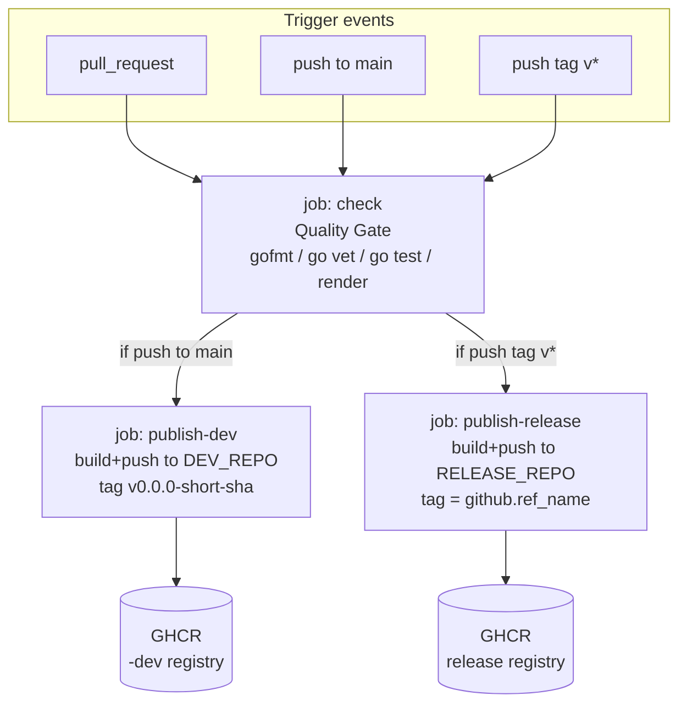

# Design Document

## Overview

This feature adds a **tag-triggered release publish job** to the single existing
CI workflow (`.github/workflows/ci.yaml`) for the `hello-crossplane-aws`
Crossplane Control Plane Project. When a Git tag matching `v*` is pushed, the
workflow runs the existing quality gate and then builds and publishes the
Package to the release GHCR repository, tagging it with the pushed Git tag name.

This is the counterpart to the already-implemented main-merge snapshot flow
(`publish-dev`). The two flows are intentionally near-identical in shape; they
differ only in three axes:

| Axis           | `publish-dev` (exists)              | `publish-release` (this design)      |
| -------------- | ----------------------------------- | ------------------------------------ |
| Trigger        | push to `main`                      | push of a `v*` tag                   |
| Registry       | `DEV_REPO` (`…-dev`)                | `RELEASE_REPO` (release repo)        |
| Package version| `v0.0.0-<short-sha>`                | the Git tag name (`github.ref_name`) |

The registry split is fixed by steering
(`.kiro/steering/tech.md#ci-and-versioning`): snapshots go to the `-dev`
registry so they never sit alongside real releases, and real releases go to the
release registry using the Git tag as the version. Because a release tag like
`v0.1.0` sorts above `v0.0.0-<sha>`, a snapshot never wins a version-constraint
resolution against a real release.

### Design principle

This is a proof of concept. The design reuses the existing job structure,
workflow-level constants (`XP_VERSION`, `RELEASE_REPO`, `DEV_REPO`,
`FUNCTION_DIR`), dependency-cache setup, GHCR login, and the
`crossplane project build`/`push` with explicit `--repository` pattern. It adds
**one new job** to the same file — no new workflow file, no new abstractions, no
behaviour change to the existing `check` and `publish-dev` jobs.

### Requirements coverage summary

| Requirement | Addressed by |
| ----------- | ------------ |
| R1 Tag push triggers release job | Job-level `if` guard on tag-push |
| R2 Quality gate precedes publish | `needs: check` + `if` |
| R3 Build then publish, ordered | Sequential steps: cache → build → push |
| R4 Publish to release registry | `--repository="${RELEASE_REPO}"` |
| R5 Version is the git tag | `--tag="${{ github.ref_name }}"` + semver guard |
| R6 Repository-flag consistency | Single `RELEASE_REPO` reference in both commands |
| R7 CLI version pinning | Reused `XP_VERSION` install-and-verify step |
| R8 Dependency cache | Reused `actions/cache` + `update-cache` steps |
| R9 GHCR auth | Reused `docker/login-action` with `GITHUB_TOKEN` |
| R10 Permissions/file/env | Existing top-level `permissions`, same file, `ubuntu-latest` |
| R11 Registry separation | Distinct `RELEASE_REPO`/`DEV_REPO`; `publish-dev` untouched |

## Architecture

The workflow keeps its current shape and gains one job. The `check` job is the
shared quality gate; both publish jobs depend on it and are mutually exclusive by
trigger.



### Trigger wiring (R1)

The workflow's `on:` block currently listens for `pull_request` and
`push` to `main`. To make a `v*` tag push start a run, the `push` trigger gains a
`tags: ['v*']` filter alongside the existing `branches: [main]`:

```yaml
on:
  pull_request:
  push:
    branches:
      - main
    tags:
      - 'v*'
```

GitHub Actions treats `branches` and `tags` under a single `push` as an OR: a
branch push matches when the branch matches, and a tag push matches when the tag
matches. A `v*` tag push starts exactly one run (R1.1). The new job's `if`
condition (below) ensures only the correct publish job runs per event.

### Job gating (R1, R2, R11)

`publish-release` gates on both the event and the ref shape:

```yaml
publish-release:
  name: publish (release)
  needs: check
  if: github.event_name == 'push' && startsWith(github.ref, 'refs/tags/v')
  runs-on: ubuntu-latest
```

- `needs: check` makes the release job wait for the full Quality Gate and run
  only if it succeeded (R2.1, R2.2, R2.4). GitHub Actions skips a job whose
  `needs` did not succeed, so a failed/cancelled gate means nothing is
  built or pushed (R2.3).
- `github.event_name == 'push' && startsWith(github.ref, 'refs/tags/v')` matches
  only tag pushes whose tag begins with `v` (R1.1). It is false for
  `pull_request` (R1.2) and for branch pushes such as `main` whose ref is
  `refs/heads/main` (R1.3). A non-`v` tag push has ref `refs/tags/<name>` and
  fails `startsWith(..., 'refs/tags/v')` (R1.4). Any other event fails
  `event_name == 'push'` (R1.5).
- `publish-dev` keeps its existing guard `github.ref == 'refs/heads/main'`, which
  is false on a tag push, so the two publish jobs never both run (R11.3, R11.5).

## Components and Interfaces

The only artifact is `.github/workflows/ci.yaml` (R10.2 — it stays the only
workflow file). No Go code, no new files.

### Workflow-level constants (reused, R7.5, R4.4)

These already exist and are reused verbatim by the new job:

- `XP_VERSION: v2.5.0` — the single pinned CLI version every job consumes
  (R7.2, R7.5).
- `RELEASE_REPO: ghcr.io/hoangviet1vu/hello-crossplane-aws` — the release
  registry, consumed by the new job for both build and push (R4.4).
- `DEV_REPO: ghcr.io/hoangviet1vu/hello-crossplane-aws-dev` — the dev registry,
  a distinct non-equal value the release job never targets (R11.1, R11.4).
- `FUNCTION_DIR` — the Go function directory for the Go toolchain setup.

`spec.repository` in `crossplane-project.yaml` stays pointed at the release repo
as the local-publish default (R11.2); the workflow overrides it with an explicit
`--repository` per job.

### Top-level permissions (reused, R10.1)

The existing top-level block already grants what the release job needs, and it
covers every job in the file:

```yaml
permissions:
  contents: read
  packages: write
```

`packages: write` lets `GITHUB_TOKEN` push to GHCR; `contents: read` allows
checkout (R10.1).

### The `publish-release` job — step sequence

The job mirrors `publish-dev` step-for-step, changing only the version
computation and the repository target. Steps run in this order, each failing the
run on a non-zero exit (fail-fast is the GitHub Actions default), which enforces
the "build before push, push nothing on earlier failure" ordering across R3, R5,
R7, R8, R9.

1. **Checkout** — `actions/checkout@v4`.

2. **Set up Go** — `actions/setup-go@v5` with `go-version-file` pointing at the
   function `go.mod`. (Needed because the CLI builds the embedded Go function
   during `project build`.)

3. **Install Crossplane CLI** — reuses the existing install-and-verify script:
   - Fail if `XP_VERSION` is unset/empty before installing (R7.3).
   - Install via the pinned `install.sh` invocation.
   - Verify the installed client version equals `XP_VERSION`, failing with a
     message naming the expected and actual versions if not (R7.1, R7.4).
   Because this step precedes the build/push steps, a CLI-pin failure publishes
   nothing (R7.3, R7.4).

4. **Validate release version** — a new guard step, before login/build/push,
   that reads `github.ref_name` and:
   - Fails if it is empty/unavailable (R5.4).
   - Fails if it does not match a semantic-version pattern (a bare SHA is
     rejected), surfacing an "invalid semantic version" error (R5.2, R5.3).
   - On success, exports the validated value for the push step (R5.1).
   Placing this before build/push means an invalid tag leaves the registry
   unchanged (R5.3).

5. **Log in to GHCR** — `docker/login-action@v3` with `registry: ghcr.io`,
   `username: ${{ github.actor }}`, `password: ${{ secrets.GITHUB_TOKEN }}`.
   Runs before any push (R9.1, R9.3). A missing/empty token or auth failure
   fails this step before build/push, so nothing is published (R9.4, R9.5). The
   later push reuses these Docker credentials — no PAT, no re-auth (R9.1, R9.2).

6. **Cache Crossplane dependencies** — `actions/cache@v4`, `path:
   ~/.crossplane/cache`, `key: crossplane-cache-${{
   hashFiles('crossplane-project.yaml') }}` with a `restore-keys` prefix
   fallback. Byte-identical project files hit the cache; any change misses
   (R8.2). A hit restores the cache dir before `update-cache` runs (R8.3); the
   post-job save persists the refreshed cache under the key on a zero-exit run
   (R8.5).

7. **Update dependency cache** — `crossplane dependency update-cache`, before
   build (R8.1). A non-zero exit fails the run here and prevents build/push
   (R8.4, R3.5).

8. **Build package** — `crossplane project build --repository="${RELEASE_REPO}"`.
   Explicit non-empty repository flag (R6.1) pointing at the release registry
   (R4.2). A build failure fails the run before push, leaving the registry
   unchanged (R3.3).

9. **Push package** — `crossplane project push --repository="${RELEASE_REPO}"
   --tag="<validated ref_name>"`. Runs only after a successful build (R3.1). The
   `--repository` value is the same `RELEASE_REPO` reference used in build, so it
   is byte-for-byte identical (R6.2, R6.3). A single `project push` ships the
   Configuration and embedded function package(s) together (R3.2). It targets
   only the release registry, never the dev registry (R4.1, R4.3, R11.4). A push
   failure fails the run and surfaces the error (R3.4).

### Repository-flag consistency mechanism (R6)

Both build and push reference the same `${RELEASE_REPO}` environment constant
rather than separate literals. This makes the two values identical by
construction (R6.3) and non-empty as long as the constant is set. The design
does **not** add a runtime byte-comparison step between the two commands: with a
single shared source there is no second value to diverge (R6.4, R6.5 are
satisfied structurally — there is exactly one flag value in the job). Similarly,
`RELEASE_REPO` is a fixed workflow constant, so R4.5's "missing/empty
`RELEASE_REPO`" case is guarded by the constant's presence in the `env` block; if
it were ever blanked, `crossplane project build` would receive
`--repository=""` and fail before any push.

### Version handling (R5)

`github.ref_name` on a tag push is the tag name with no `refs/tags/` prefix
(e.g. `v0.1.0`). It is passed to `--tag` with no transformation, truncation, or
prefix stripping (R5.1). The validate step gates on a semver pattern so a tag
that is not a valid semantic version fails before push (R5.2, R5.3), and an
empty/unavailable ref name fails before push (R5.4).

## Data Models

This feature has no application data models. The relevant "data" is the set of
workflow inputs and the constants the release job consumes:

| Name                     | Source                              | Used for                                   |
| ------------------------ | ----------------------------------- | ------------------------------------------ |
| `github.event_name`      | GitHub Actions context              | Job `if` guard (must be `push`)            |
| `github.ref`             | GitHub Actions context              | Job `if` guard (`startsWith refs/tags/v`)  |
| `github.ref_name`        | GitHub Actions context              | Release version → `--tag`                  |
| `github.actor`           | GitHub Actions context              | GHCR login username                        |
| `secrets.GITHUB_TOKEN`   | Built-in token                      | GHCR login password                        |
| `env.XP_VERSION`         | Workflow `env`                      | CLI pin (install + verify)                 |
| `env.RELEASE_REPO`       | Workflow `env`                      | `--repository` for build and push          |
| `env.DEV_REPO`           | Workflow `env`                      | Distinctness reference (never targeted)    |
| `env.FUNCTION_DIR`       | Workflow `env`                      | Go setup `go-version-file` path            |
| `crossplane-project.yaml`| Repo file (hashed)                  | Dependency cache key                       |

## Correctness Properties

This feature is not a candidate for PBT (property-based testing). The deliverable
is a declarative GitHub Actions workflow job, not a pure function with inputs and
outputs. No universally quantified correctness statement over a generated input
space adds value here: the job's behaviour is fixed conditional wiring plus a
fixed sequence of CLI invocations, and its correctness is verified by
trigger-matching logic and end-to-end execution, not by randomized input
generation. Per the workflow's own guidance (IaC / CI configuration → snapshot
and example-based checks), no correctness properties are defined for this
feature. See Testing Strategy for the approach used instead.

## Error Handling

GitHub Actions fails a step on any non-zero exit and, by default, fails the job
(and cancels dependents), so most error paths need no special handling beyond
ordering. Explicit guards are added where a silent success would be dangerous.

| Failure | Handling | Requirement |
| ------- | -------- | ----------- |
| Quality Gate fails / is skipped / cancelled | `needs: check` skips the release job; run status reflects the failing gate step | R2.3 |
| `XP_VERSION` unset/empty | Install step exits non-zero before the gate/publish | R7.3 |
| Installed CLI ≠ `XP_VERSION` | Verify step exits non-zero, message names expected vs actual | R7.4 |
| Release tag empty/unavailable | Validate step exits non-zero before push | R5.4 |
| Release tag not valid semver | Validate step exits non-zero, "invalid semantic version" error, registry unchanged | R5.2, R5.3 |
| GHCR auth fails / token missing | Login step exits non-zero before build/push, nothing published | R9.4, R9.5 |
| `dependency update-cache` non-zero | Build/push not invoked, run fails with cache-refresh error | R8.4, R3.5 |
| `project build` fails | Push not invoked, run fails, registry unchanged | R3.3 |
| `project push` fails | Run fails, push error surfaced | R3.4 |
| `--repository` empty | `project build` receives `--repository=""` and fails before push | R6.4, R4.5 |
| Docker daemon unavailable | Build/render step fails, error surfaced, nothing pushed | R10.4 |

Step ordering is the primary safety mechanism: validation and login precede
build, and build precedes push, so any earlier failure leaves the Release
Registry untouched.

## Testing Strategy

Consistent with a CI-workflow change, verification is example-based and
execution-based rather than property-based.

### Static validation

- **YAML lint / schema**: confirm `ci.yaml` remains valid GitHub Actions YAML and
  the only file under `.github/workflows/` (R10.2).
- **Trigger-logic review**: inspect the `on:` block and the `publish-release`
  `if` guard against the R1 truth table below.

### Trigger truth table (example-based)

| Event                     | `event_name` | `ref`                | `publish-release` runs? |
| ------------------------- | ------------ | -------------------- | ----------------------- |
| Push tag `v0.1.0`         | push         | `refs/tags/v0.1.0`   | yes (R1.1)              |
| Pull request              | pull_request | —                    | no (R1.2)               |
| Push to `main`            | push         | `refs/heads/main`    | no (R1.3)               |
| Push tag `nightly`        | push         | `refs/tags/nightly`  | no (R1.4)               |
| `workflow_dispatch`, etc. | other        | —                    | no (R1.5)               |

Mutual exclusion with `publish-dev` (guarded on `refs/heads/main`) is checked at
the same time (R11.3, R11.5).

### Semver validation (example-based)

Exercise the validate step's pattern against representative inputs:

- Accept: `v0.1.0`, `v1.2.3`, `v0.1.0-rc.1`, `v0.1.0+build.5`.
- Reject: empty string, a bare short SHA (e.g. `a1b2c3d`), `latest`,
  `v1` / `v1.2` (incomplete), `1.0.0` if the policy requires the `v` prefix
  matched by the trigger.

This maps to R5.1–R5.4 and can be validated locally by running the guard script
fragment with the candidate values.

### End-to-end verification (integration, low iteration)

Because the publish path touches GHCR and the beta project workflow, validate it
with a small number of representative runs rather than repeated iterations:

- **Dry inner loop**: `crossplane project build --repository=<release repo>`
  locally to confirm the build succeeds with an explicit repository flag
  (R3.1, R6.1). Do not push from a workstation during verification.
- **Real release rehearsal**: push a disposable prerelease tag (e.g.
  `v0.0.1-test.1`) and confirm: the release job runs after `check`, the package
  lands in the release registry tagged with the exact tag name, and nothing lands
  in the `-dev` registry (R4.1, R4.3, R5.1, R11.4). Delete the test tag and
  package afterward.
- **Registry separation spot-check**: after a `main` merge and after a tag push,
  confirm each targeted only its own registry (R11.3, R11.4, R11.5).

### Definition of done for this feature

1. `ci.yaml` is valid, remains the sole workflow file, and adds only the
   `publish-release` job plus the `tags: ['v*']` trigger filter.
2. The `check` and `publish-dev` jobs are byte-for-byte unchanged except where
   the shared `on:`/`env` blocks are edited.
3. The trigger truth table holds and the two publish jobs are mutually
   exclusive.
4. A rehearsal tag publishes to the release registry with the tag as the version
   and touches no other registry.
